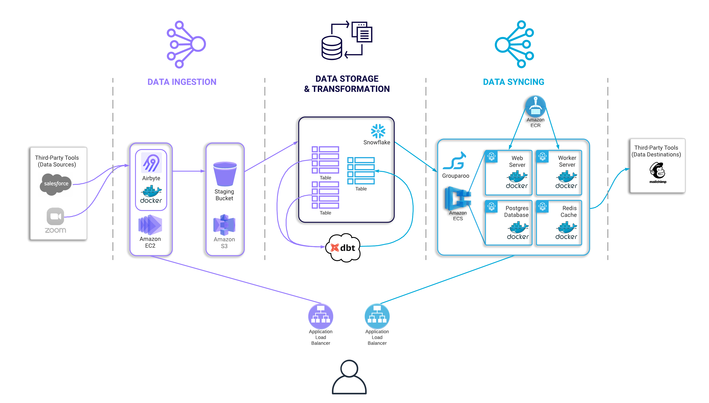

The above diagram shows the complete infrastructure of a Tapestry pipeline that is provisioned with `deploy`/`kickstart`. This specific diagram also shows the preconfigured sources and destinations that are configured in our `kickstart` command. For a deeper understanding of this architecture and what each piece is doing, please read our [case study](https://tapestry-pipeline.github.io).
