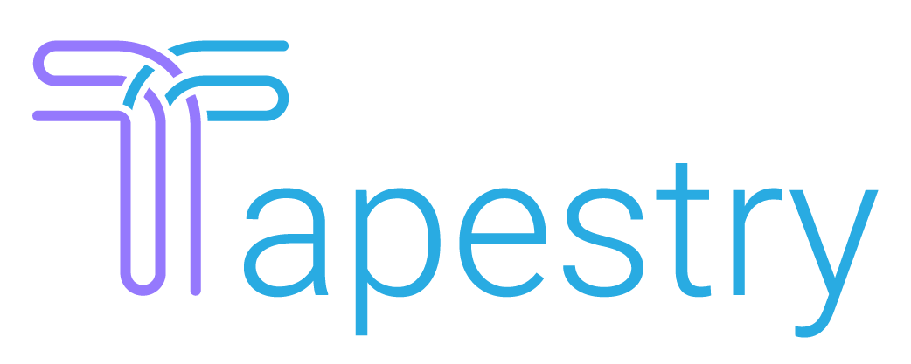

## Overview

Tapestry is an open source orchestration framework for the deployment of user entity data pipelines. It allows users to easily configure and launch an end-to-end data pipeline hosted on Amazon Web Services. Our automated solution combines best-in-class tools to create a warehouse-centric data stack, offering built-in data ingestion, transformation, and newly emerging data syncing (also known as "reverse ETL") technologies. Our inclusion of a reverse ETL component solves the "last mile" problem by providing the ability to operationalize collected user data in near real time.

[Read our case study for more information about user data pipelines and to learn how we built Tapestry.](https://tapestry-pipeline.github.io)
